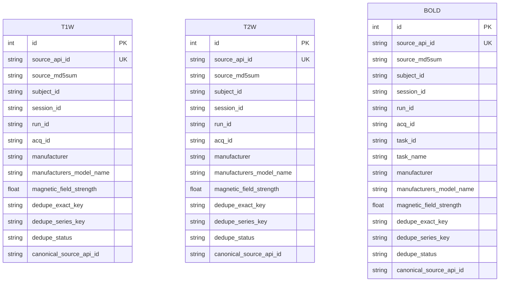
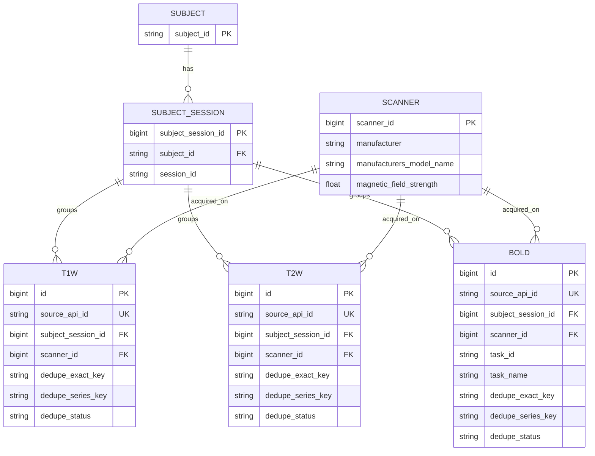

# Entity Relationship Model

## Current Physical Model

The current ORM is intentionally simple:

- `t1w`
- `t2w`
- `bold`

Each table stores:

- source lineage from the MRIQC API
- shared BIDS metadata fields
- dedupe fields
- modality-specific IQMs

There are no foreign keys between the three tables yet.



## What Actually Links Modalities

`subject_id` is the strongest common key, but it is not enough by itself for a
useful relational model.

More useful anchors are:

1. `subject_id`
2. `subject_id + session_id`
3. scanner tuple:
   `manufacturer + manufacturers_model_name + magnetic_field_strength`

What is not reliable enough to force a cross-modality join:

- `run_id`
- `acq_id`
- `task_id`
- `source_md5sum`

Those fields are useful within a modality or within dedupe logic, but they do
not give a stable generic link between `T1w`, `T2w`, and `bold`.

## Recommended Normalization Direction

If we normalize next, I would not try to invent a universal cross-modality
`scan` entity immediately. The source data does not provide a guaranteed scan
bridge. I would normalize in this order:

1. `subject`
2. `subject_session`
3. `scanner`
4. modality fact tables referencing `subject_session` and `scanner`
5. optional raw observation tables if we want to separate canonical facts from
   every ingested source row

That gives us meaningful relationships without pretending we can identify a
single cross-modality acquisition object from the source.



## Dedupe Implications

The sample already shows two real duplicate shapes:

- exact payload duplicates via `provenance.md5sum`
- repeated BIDS identities within the same modality

That means dedupe should remain modality-local at first.

Recommended keys:

1. `dedupe_exact_key`
   Derived from `provenance.md5sum`
2. `dedupe_series_key`
   Derived from normalized modality-specific identity fields

For example:

- `T1w` and `T2w`: `subject_id`, `session_id`, `run_id`, `acq_id`, scanner
  tuple, echo/repetition/inversion timing, voxel size, image size
- `bold`: the same plus `task_id`, `task_name`, and `spacing_tr`

## Postgres Target

Local development now targets PostgreSQL through [compose.yaml](/Users/johnlee/.codex/worktrees/e67a/mriqc-aggregator/compose.yaml).

Basic flow:

```bash
cp .env.example .env
pixi run db-up
pixi run db-init
```

The schema initialization uses
[mriqc_aggregator/database.py](/Users/johnlee/.codex/worktrees/e67a/mriqc-aggregator/mriqc_aggregator/database.py)
and the thin wrapper in
[scripts/init_db.py](/Users/johnlee/.codex/worktrees/e67a/mriqc-aggregator/scripts/init_db.py).

